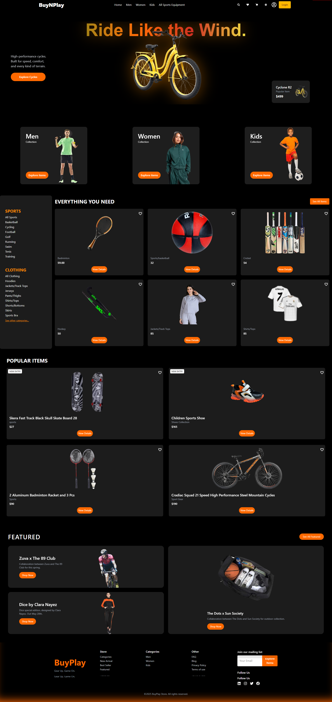

# 🎮 BuyNPlay - Sports Equipment E-Commerce Store

BuyNPlay is a dynamic and responsive e-commerce web application designed for buying and selling sports equipment. It offers users a smooth browsing experience, product details, and the ability to manage their items — all built with modern tools and user-centric design.

## 🌐 Live Demo

🔗 [Live Website](https://buynplay-store.web.app/)  

---

## 🧰 Technologies Used

- **React JS** – Frontend library
- **Tailwind CSS & DaisyUI** – Styling & responsive UI components
- **React Router** – Page routing
- **Node.js & Express.js** – Backend server
- **MongoDB** – Database
- **Firebase Auth** – Authentication system
- **Custom Hooks** – React optimization
- **JSON Server / Custom Backend API** – For data operations

---

## ✨ Key Features

- 🔄 **Theme Toggle** – Light & Dark mode using CSS variables
- 🛒 **All Sports Equipment** – View all items with image, category, and price
- 🔍 **Sort Functionality** – Sort equipment by price (ascending)
- ➕ **Add / Update Equipment** – Authenticated users can add and update products
- 🔐 **Authentication** – Firebase login system with private routes
- 📱 **Fully Responsive** – Optimized for mobile, tablet, and desktop
- ⚡ **Dynamic Routing** – Product details pages with React Router
- 🔁 **Reusable Components** – DRY principles followed in design

---

## 📸 Screenshots

### 🏠 Home Page


---

## 📁 Folder Structure (Client)

buynplay-store-client/
├── public/
├── src/
│ ├── components/
│ ├── Hero/
| ├── Layout/  
| ├── Section/ 
| ├── ThemeToggle/
| ├── Pages/
│ ├── Provider/
│ ├── Router/
│ ├── main.jsx
│ └── index.css
├── package.json
└── package.json


---

## 🚀 How to Run Locally

```bash
# 1. Clone the repo
git clone https://github.com/Mili-Akthere/BuyNPlay.git

# 2. Go to the project directory
cd buynplay-store-client

# 3. Install dependencies
npm install

# 4. Start the development server
npm run dev
